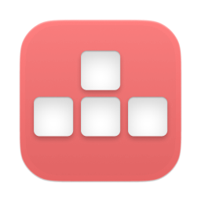

<div align="center">
    
    <h1>KeyOvr</h1>
</div>

KeyOvr (stands for Keystroke Overlay) is an open source WASD keystroke visualizer app for MacOS.

[](https://github.com/fizxxr/KeyOvr/releases/latest)


[](LICENSE)

**Contents**

- [Installation](#installation)
  - [Manual Installation](#Manual)
  - [Installation via Homebrew](#Homebrew)
- [Features](#roadmap/features)
  - [Appearance](#appearance)
  - [Layout](#layout)
  - [Others](#others)
- [Troubleshooting](#troubleshooting)
- [Gallery](#gallery)
- [Frequently asked Questions](#frequently-asked-questions)
- [License](#license)

## Installation

### Manual

Download the latest `KeyOvr.dmg` file from the [Release page](https://github.com/fizxxr/KeyOvr/releases) then open the dmg and drag the app into the `Applications` folder.

### Homebrew

If you have homebrew installed, you can Install KeyOvr using the command:

```sh
soon
```

## Roadmap/Features

### Appearance

- [x] Change All Background Transparency
- [x] Change Button Corner Radius
- [x] Change Font
- [x] Change Font Offset
- [ ] Change Font Size
- [ ] Chroma (RGB)
- [ ] Change Specific Background Transparencies
- [ ] Change Text Transparency when pressed
- [ ] Change Background Transparency when pressed
- [ ] Change Text Color
- [ ] Change Background Color

### Layout

- [x] Change Scale
- [x] Change Button Spacing
- [x] Toggle Enable and disable keys
- [x] CPS
- [x] Arrow Keys Mode
- [x] Add/Remove Custom keys
- [ ] Toggle Custom keys

### Others

- [x] Toggle Show/Hide Keystrokes
- [x] Drag Keystrokes Position

## Troubleshooting

### Soon

## Gallery

#### Repositioning Keystrokes


## Frequently Asked Questions

### Why does KeyOvr only support macOS 14 and later?

KeyOvr uses system APIs that are only available for macOS 14 or later.

## License

KeyOvr is available under the [BSD 3-Clause license](LICENSE).
